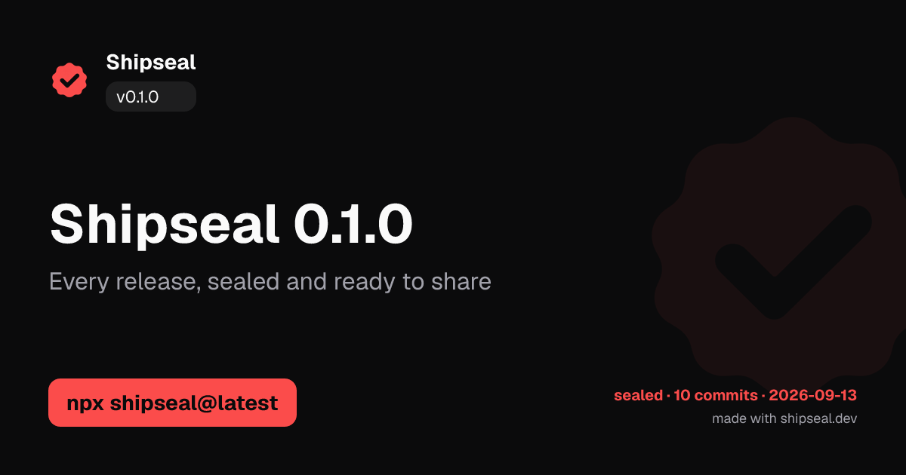
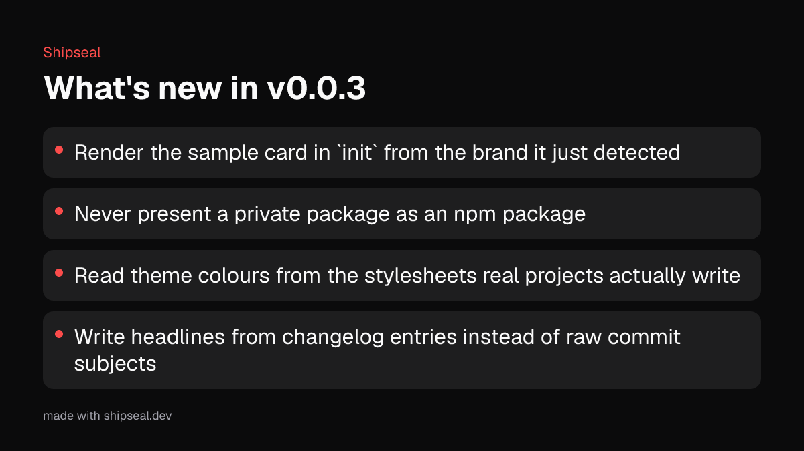
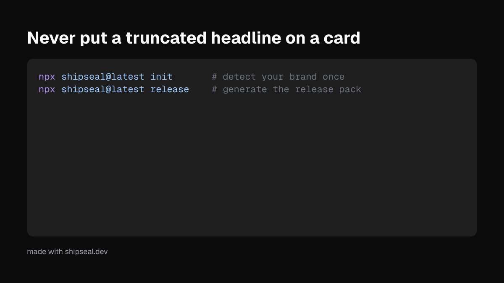

<p align="center">
  <picture>
    <source media="(prefers-color-scheme: dark)" srcset="./assets/brand/wordmark-white-800.png">
    
  </picture>
</p>

<p align="center">
  <strong>Every release, sealed and ready to share.</strong>
</p>

Shipseal turns your repo's releases, milestones, and benchmarks into ready-to-post visuals: OG images, X and LinkedIn cards, GitHub social previews. On brand, at the right size, with **every number verified** from a real source.

> Status: **early alpha**, published as `shipseal` on npm. The CLI and the GitHub Action both
> work end to end and Shipseal generates its own release cards. Interfaces may still change
> before 1.0. Follow progress at [shipseal.dev](https://shipseal.dev).

## What it produces

Every image below was generated by Shipseal for its own `v0.0.3` release, by the workflow in
this repository. Nothing was edited by hand.

<p align="center">
  
</p>

The headline comes from the changelog entry, the version from the git tag, and the colours from
the brand kit `shipseal init` detected. Every one of those is listed with its source in
`manifest.json`.

<p align="center">
  
</p>

Highlights come from the changelog, one sentence each, sized to fit rather than truncated.

<p align="center">
  
</p>

Code cards pull a snippet from your README or a file you point at, highlighted with Shiki and
rendered without a browser.

The same release also produced GitHub social, X, and LinkedIn sizes, plus a highlights card.
See the [v0.0.3 release](https://github.com/akii09/shipseal/releases/tag/v0.0.3) for the whole
pack, attached automatically by the Action.

## Why

Agents made shipping fast. Announcing still takes an hour in Figma. AI image tools mangle text and invent numbers. Shipseal reads facts your repo already has and renders them deterministically, with no browser and no image model.

## How it works

```
repo facts  ->  optional AI copy (words only)  ->  your brand + templates  ->  Takumi render  ->  image pack + manifest
```

Every number on a card comes from git, the GitHub API, npm, or your CI, and is listed with its source in `manifest.json`.

## Planned usage

```bash
npx shipseal@latest init       # detect your brand once
npx shipseal@latest release    # generate the release pack
```

`npx` reuses a cached copy, so plain `npx shipseal` can keep running an old version for days.
The `@latest` tag forces it to check the registry. Pin an exact version in CI instead, so a
release never changes under you.

```yaml
# .github/workflows/shipseal.yml
on: { release: { types: [published] } }
permissions: { contents: write }
jobs:
  visuals:
    runs-on: ubuntu-latest
    steps:
      - uses: actions/checkout@v7
        with: { fetch-depth: 0 }
      - uses: akii09/shipseal@v1
        env: { GITHUB_TOKEN: "${{ secrets.GITHUB_TOKEN }}" }
```

## v1 scope

- Release pack: hero (OG, GitHub social, X, LinkedIn), highlights card, code card
- Milestone cards: stars, npm downloads, contributors
- Benchmark cards: before/after from a JSON file
- Automatic text fitting, dark and light themes
- CLI and GitHub Action

## Contributing

Read [AGENTS.md](./AGENTS.md) and [docs/PROJECT_PLAN.md](./docs/PROJECT_PLAN.md) first. See [CONTRIBUTING.md](./CONTRIBUTING.md).

## Brand assets

Logo and icon files live in [`assets/brand/`](./assets/brand). Use the source files for
print or large surfaces and the sized variants for the web:

| File | Size | Use |
|---|---|---|
| `wordmark.png` | 2120x742 | source wordmark (light) |
| `wordmark-800.png` | 800 wide | README, docs headers (light) |
| `wordmark-white.png` | 2119x742 | source wordmark (dark) |
| `wordmark-white-800.png` | 800 wide | README, docs headers (dark) |
| `icon.png` | 1254x1254 | source icon |
| `icon-512.png` | 512x512 | app icon, social profile |
| `icon-180.png` | 180x180 | apple touch icon |
| `icon-32.png` | 32x32 | favicon |

## License

MIT. Rendering powered by [Takumi](https://takumi.kane.tw).

The bundled Geist Mono font is licensed separately under the SIL Open Font License 1.1.
See [`packages/shipseal/assets/fonts/`](./packages/shipseal/assets/fonts).
